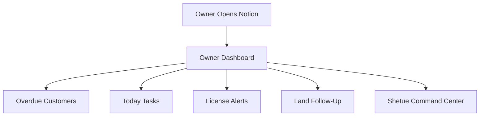

# Shetue OS Full System Report (Apr 2026)

**Generated:** 17 April 2026 | **Last Updated:** 19 April 2026, 8:28 AM | **Owner:** Shetue Multibiz | **Workspace:** Shetue OS

This is the complete status report of all systems, databases, and operations across Shetue Group.

---

## 1. 🏗️ WORKSPACE STRUCTURE

| **Section** | **Page/Area** | **Status** |
| --- | --- | --- |
| 🚀 Main Entry | Shetue OS (Main) | ✅ Active |
| 📊 Daily Control | Owner Dashboard (Control Center) | ✅ Active |
| 🏠 Operations | Operating HQ (Daily) | ✅ Active |
| ⚙️ System | System & Automation | ✅ Active |
| 📂 Compliance | Compliance & Control (Legal Vault) | ✅ Active |
| 📂 Master DBs | Master Databases Hub | ✅ Active |
| 📂 Business Units | 02_Business Units | ✅ Active |
| 📂 01_Master DBs | 01_Master Databases (Land + Tasks) | ✅ Active |

---

## 2. 🗄️ ALL DATABASES — STATUS REPORT

### 💰 Finance & Cash Flow
| **Database** | **Purpose** | **Status** |
| --- | --- | --- |
| 💰 Customers & Due | Track all customers + outstanding receivables | ✅ Built |
| 📞 Collection Activity Log | Daily follow-up and payment collection tracking | ✅ Built |
| 🏦 Loan & Liability Tracker | All loans, credit cards, liability tracking | ✅ Built |
| Loan & CC Tracker | Bank loans + credit card management | ✅ Built |
| 📊 Daily KPI | Daily performance measurement | ✅ Built |
| 📊 Daily Reports | Daily business reporting | ✅ Built |

### 🏗️ Shetue Engineering (e-GP Tender)
| **Database** | **Purpose** | **Status** |
| --- | --- | --- |
| 📋 Tender Tracker | All live and past tenders | ✅ Built |
| Active Tenders | Filtered view of current tenders | ✅ Built |
| Running Projects | Ongoing construction/engineering work | ✅ Built |
| 🏗️ Completed Projects | Finished projects archive | ✅ Built |
| 🏢 Clients & Departments | Client orgs (PWD, LGED, RHD etc.) | ✅ Built |
| 🗄️ Document Vault | Licenses, certs, tender documents | ✅ Built |
| 📊 Profit Summary | Per-project profit tracking | ✅ Built |
| Expiring Documents | Alerts for doc renewal | ✅ Built |
| Submission Deadlines | Upcoming tender deadline tracker | ✅ Built |

### 🌍 Land & Property
| **Database** | **Purpose** | **Status** |
| --- | --- | --- |
| 🌍 Master Land Bank | All land assets — mutation, tax, deed status | ✅ Built (7 views) |
| 📊 Land Revenue Tracker | Revenue from land assets | ✅ Built |
| 🌍 Land Status Overview | Dashboard view of land status | ✅ Built |
| 🌍 Land Risk & Follow-Up | High-risk land tracking | ✅ Built |

### ⚙️ Compliance & Admin
| **Database** | **Purpose** | **Status** |
| --- | --- | --- |
| 📜 License Vault | All business licenses with expiry alerts | ✅ Built |
| 🔐 Digital Access Control | Login credentials and access management | ✅ Built |
| 🔑 Digital Credentials | System passwords and API keys | ✅ Built |
| 🚨 License Alerts | Filtered view — expiring within 30 days | ✅ Built |

### 📋 Task & Operations
| **Database** | **Purpose** | **Status** |
| --- | --- | --- |
| 📋 Task Manager | Master task list across all divisions | ✅ Built |
| ✅ Global Tasks & Follow-ups | Cross-division task and follow-up control | ✅ Built |
| ✅ Daily Task Tracker | Day-by-day task execution | ✅ Built |
| 📌 Today Tasks | Today's priority task list | ✅ Built |
| Project Tasks | System/tech project task tracking | ✅ Built |

---

## 3. 📊 DIVISION STATUS

| **Division** | **In Notion** | **Control Panel** | **Zoho Books** | **Status** |
| --- | --- | --- | --- | --- |
| ⛽ Filling Station | ✅ Yes | ✅ Yes | ⚠️ Setup needed | 🟡 Partial |
| 🔥 CNG Refuelling | ✅ Yes | ❌ No panel | ⚠️ Setup needed | 🔴 Incomplete |
| 🛢️ LPG Auto Gas | ✅ Yes | ❌ No panel | ⚠️ Setup needed | 🔴 Incomplete |
| 🌽 Feed Mills | ✅ Yes | ❌ No panel | ⚠️ Setup needed | 🔴 Incomplete |
| 💊 Pharmacy | ✅ Yes | ❌ No panel | ⚠️ Setup needed | 🔴 Incomplete |
| 💻 Shetue Tech | ✅ Yes | ❌ No panel | ⚠️ Setup needed | 🔴 Incomplete |
| 🏗️ Shetue Engineering | ✅ Yes | ✅ Full system | ❌ Not linked | 🟡 Good base |

---

## 4. ✅ DONE vs ❌ REMAINING

### ✅ Completed
- [x] Shetue OS (Main) workspace structure
- [x] Owner Dashboard (Control Center)
- [x] Operating HQ (Daily) with overdue + follow-up
- [x] Master Land Bank (7 views)
- [x] Land Control SOP
- [x] Task Manager + Global Tasks
- [x] Filling Station Control Panel
- [x] Shetue Engineering — full 9-database tender system
- [x] Compliance & Control (Legal Vault)
- [x] System & Automation (with architecture SOP)
- [x] Zoho Books audit report 
- [x] Notion Architecture SOP
- [x] Digital Access Control platforms added
- [x] Codex Cloud — GitHub repo analysis documented
- [x] Social Media Links — 25+ profiles added
- [x] Fix Google Drive Batch Script
- [x] Universal System One-Click Launcher

### ❌ Remaining / Incomplete
- [ ] **Zoho Books** — Division tags NOT yet activated (CRITICAL)
- [ ] **CNG, LPG, Feed, Pharmacy, Tech** — no individual control panels
- [ ] **Zoho ↔ Notion sync** — not connected (n8n/API not running)
- [ ] **WhatsApp auto-reminders** — planned but not active
- [ ] **e-GP tender fields audit** — Tender ID, Package No, OTM/LTM check
- [ ] **Per-project sub-pages** — individual project folders in Running Projects
- [ ] **Win/Loss tracker** — after tender submission
- [ ] **Google Drive naming** — YYYY_Unit_DocName standard not enforced
- [ ] **Daily cash reconciliation** — Google Sheets bridge not built
- [ ] **Bangla VoiceCal** — in archive, not deployed
- [ ] **n8n VPS automation** — setup started, not complete
- [ ] **Business Dashboard** — exists but not fully populated
- [ ] **Digital Access Control** — 280+ remaining platforms from Bitwarden
- [ ] **GitHub repo** — /zoho, /docs, /reports, /dashboard folders not yet created

---

## 5. 🔥 PRIORITY ACTION LIST
*🚨 These must be done first — highest business risk.*

1. **Zoho Books — Activate Division Tags** → Without this, no division P&L is possible
2. **Zoho Books — Lock FIFO** before creating any inventory items
3. **Zoho Books — Enter Opening Balances** → Start clean accounting
4. **Tender Tracker — Field Audit** → Verify fields
5. **Build Division Control Panels** → CNG, LPG, Feed Mills, Pharmacy, Shetue Tech
6. **n8n Automation** → Connect Zoho ↔ Notion for daily sync
7. **WhatsApp Reminder** → Auto due payment alerts
8. **Google Drive naming** → Enforce document naming standard

---

## 6. 💡 SYSTEM FLOW

## 7. 📌 SYSTEM RULES (Do Not Break)
- ✅ All PDFs/files go to **Google Drive** — Notion stores only the link
- ✅ All sales must have a **Zoho invoice same day**
- ✅ All transactions must carry a **Division Tag** in Zoho
- ✅ Every customer must have a **Credit Limit + Payment Terms**
- ❌ Do NOT create random pages in sidebar
- ❌ Do NOT store credentials in plain page text
